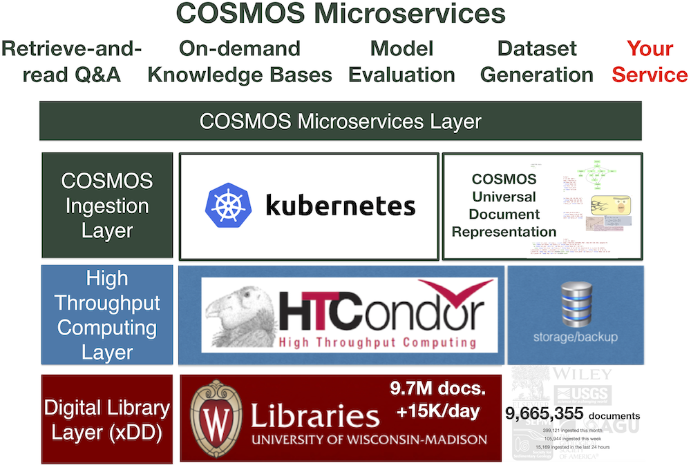

# Goals and Approaches for TA1 Phases and Tasks

## Phase 1
See our [Milestone 3 Report](https://github.com/UW-COSMOS/project-docs/tree/master/presentations_reports/milestone_3) for an overview of Phase 1 outcomes and links to relevant repos.
### Task 1: Extraction of Models from Publications
Design and implement methods to extract models and semantically meaningful components of models that are reported in the literature in the form of equations. Incorporate weakly supervised KBC systems for such models into the ASKE pipeline.

### Task 2: Table and Figure Extraction
Develop methods that extend xDD with a scalable table, figure, and equation extraction engine that leverages state-of-the-art methods.

Our end-to-end pipeline for Phase 1 is documented and available as docker image here in our [cosmos-demo repo](https://github.com/UW-COSMOS/cosmos-demo). See linked repos for individual code components.

## Phase 2
### Task 1: Extraction of Model Metadata
Develop data extraction and integration methods to collect data and model metadata (from text). Extracted information will correspond to specified scientific model boundary conditions and parameterizations and will be used to validate and assess model output.

* _cGENIE_: widely used community Earth systems model, oriented around carbon (https://github.com/UW-COSMOS/cgenie.muffin)

### Task 2: Data Extraction from Tables and Figures
Design and implement methods for 1) automatic extraction of  model parameterizations from tables, and 2) extraction of data from tables and figures. Implementation of methods that link data back to model code and the knowledge base developed during Task 1 will enable human-in-the-loop automated refinement ad assessment of scientific models.

