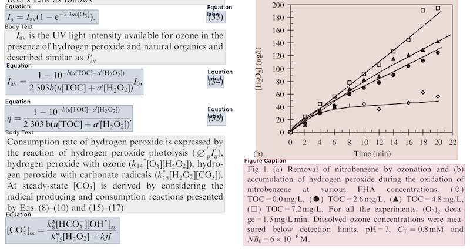
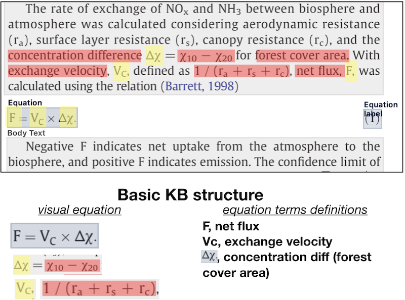
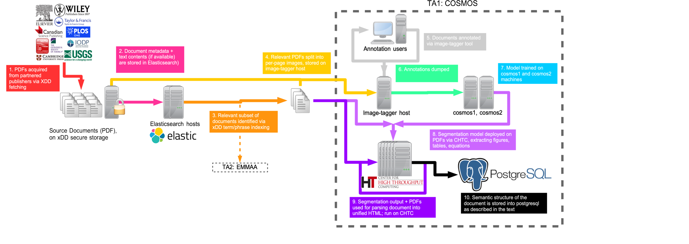
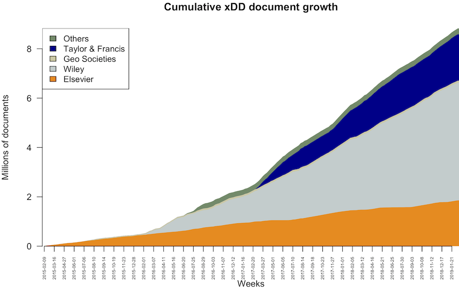
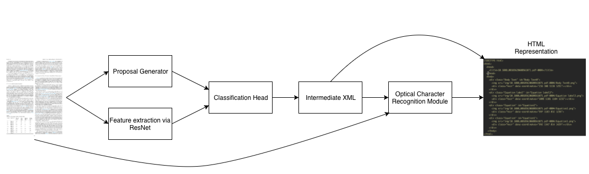
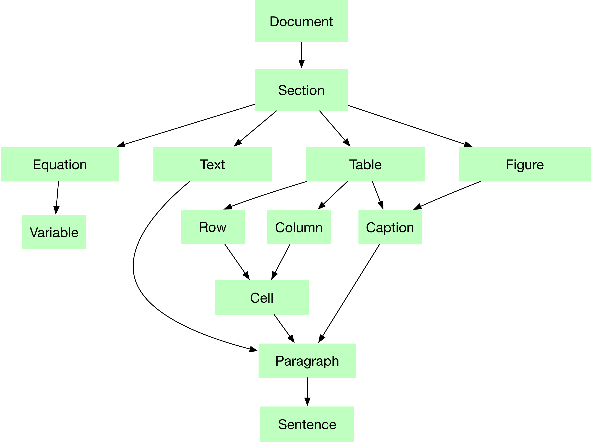
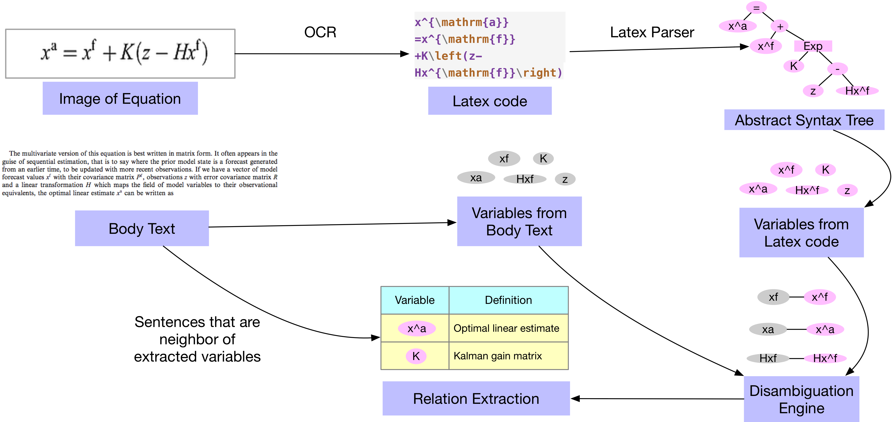

# Design and implementation of model equation and table/figure extraction methods
## Introduction
The development, refinement, and assessment of scientific models that describe natural phenomena depends heavily on empirical and experimental data and observations reported in the text, tables and figures of scientific publications. The theoretical underpinnings of models and key model components are also commonly expressed in the form of equations and accompanying text-based descriptions. The ability to locate and assemble specific data and information relevant to a given scientific model from across hundreds, thousands, or even millions of publications, and do so in a way that keeps up-to-date as new publications are produced, is a major barrier to scientific progress.

Here we provide an interim report on the design and implementation of our prototype system for automatically locating and extracting from the published literature data and information pertinent to scientific models. Two primary tasks constituted the focus of this TA1 project milestone:

1. Model equation extraction from PDFs
2. Table/figure extraction from PDFs

Both of these tasks require the development and deployment of methods to automatically visually segment, classify, and represent heterogeneous elements (i.e., equations, tables, figures, captions, body text blocks) within PDF documents from multiple publishers in a way that maintains contextual relationships to text-based information. Extracted equation, table, and figure elements and text must then be represented in a way that can be used in inference steps (i.e., automated knowledge base construction). We focus functionality on PDF input because the majority of published data and information in many domains of science, particularly those with field-based observational data, are available primarily or exclusively in PDF formats.

Below, we first describe the general nature of the problem and our multimodal approach. Next, we document the software tools that we are developing and/or modifying to address the problem. We then provide initial quantitative results describing the recall and precision of equation, table, and figure element extraction from full-text PDFs from multiple different commercial and open-access sources. The performance of our code and workflow and our ability to scale to multiple millions of documents in xDD infrastructure are also preliminarily assessed.

### Objectives and Challenges
The following visual excerpt from a PDF, manually annotated using our in-house image tagging [application](https://github.com/UW-COSMOS/image-tagger), contains body text blocks, equations, equation labels, a figure, and a figure caption:  



Our primary objective is to automatically recognize and visually extract all of these components from heterogeneous scientific publications while at the same time preserving explicit association with text-based information. For example, Equation 33, above, contains the variable *I<sub>av</sub>*, which is described in plain language in the underlying body text element. Similarly, the lowest body text block contains call-outs to specific equations [(8)-(10) and (15)-(17)] which identify them as *radical producing and consumption reactions.* This text-derived semantic description of equations is required to understand the phenomena and contexts to which they apply. Table and figure elements have analogous properties, and fully understanding their contents usually requires incorporation of information from associated captions. Labels for figures and tables (e.g., Fig. 7, Table 1) also relate the content to more complete semantic descriptions in body text.

Ultimately, text, tables, figures, and equations must be parsed, read and explicitly related to one another in order to create a knowledge base that can used to inform scientific models. An example of equation and text-entity recognition and tuple extraction suitable for representation in a simple knowledge base follows:   



## Executive Summary: Infrastructure and Software Components
There are four main computing infrastructure and software components in the DARPA TA1 COSMOS project:

1. Document fetching, storage, and pre-processing systems
2. Document annotation and training data acquisition
3. Document segmentation and segment classification
4. Fonduer-based model extraction

Combining these components provides a cross-disciplinary platform capable of accelerating the reproducibility and scalability of scientific research. It also provides an infrastructure for scientific model curation and knowlege base construction (Phase II COSMOS project objective). Below we describe the design and implementation of our prototype COSMOS system:



### Document Fetching, Storage and Processing System
A key component of the infrastructure we are developing is an extension of the [GeoDeepDive](https://geodeepdive.org) document acquisition, storage, and processing system. This digital library and computing infrastructure, called **xDD**, is capable of supporting a wide range of activities that require information to be continuously located and extracted from published documents. Currently, xDD contains over 8.8 million documents, principally from journals and other serials, that have been published by a variety of open-access and commercial publishers. Documents in xDD span all domains of science and biomedicine and the library continues to grow by some 8K documents daily. As a result, xDD is currently the single largest source of published scientific information that can be leveraged by multiple, collaborating teams.



The distinguishing characteristics of the COSMOS xDD infrastructure are our ability to:

1. Continuously acquire and store PDF documents and bibliographic metadata from partnered publishers.
2. Extract and index the text layer from the PDF documents, allowing rapid discovery of relevant literature.
3. Rapidly process all stored documents via the over quarter million CPU hours that are available daily on UW-Madison's Center for High Throughput Computing (CHTC) cluster.

Because access to a large collection of documents, and the computing capacity required to parse and extract information from them, is foundational to any activity that seeks to automate the utilization of published scientific information, we are well-positioned to succeed and to contribute to the success of other ASKE teams. For example, we are currently beginning collaboration with the TA2 EMMAA project by deploying elements of their current pipeline on our larger xDD and COSMOS system. The work of other ASKE team members that depends on access to the published literature may also benefit in ASKE Phase 2.

### Collection of Training Data and Annotations

Due to the lack of flexible, open-source image tagging software oriented for the
web, we developed an in-house system to collect, validate, and visualize training
data for our models. The system is composed of two loosely-coupled components:
[**image-tagger**](https://github.com/UW-COSMOS/image-tagger) is a *React*-based
frontend component for displaying the location of tagged bounding boxes atop an
image (here, a page of text). [**image-tagger-api**](https://github.com/UW-COSMOS/image-tagger-api)
is a webserver component that provides bounding boxes to **image-tagger** and
allows the saving of new training data from the frontend into a SQLite database
for incorporation into model implementations. Both **image-tagger** and
**image-tagger-api** are open-source and extensible software components that are
useful bot within and beyond the model pipeline discussed here.

In addition to saving and validating training data, the **image-tagger** frontend
supports the visualization of arbitrary bounding boxes atop a page and forms
the core of a system for visualizing output from the model pipeline. To this end,
a modified **image-tagger-api** serves model output in a "View" mode, allowing
inspection of model results.

To train models for integrating equation data, the next milestone will expand
**image-tagger** to incorporate the capture of relational information, such as
the links between variables in an equation and in text. Further evolution of the
rest of the model pipeline will include more seamless and automated integration
of **image-tagger** to view various process endpoints.

### Table, Figure, and Equation Extraction
<Figure>

</Figure>

Page element extraction is the task of taking as input a representation of a page and from that representation extracting information. Optical character recognition is one such extraction task: given an image representation of a page, output a stream of characters. A stream of characters, however, is inadequate for representing how scientific papers communicate key information: the layout of the paper, specifically with regard to the position of figures, tables, and equations relative to text, are integral. It follows that our task requires that given an image representation input, we output a representation that both communicates the text content of the paper as well as the layout.

To do this, we build a system that first identifies the location of each important element on a page, decides what type that element is, then extracts the textual information from within that element. For the first two steps, we adapt a popular model from the computer vision community, Faster-RCNN. Primarily used for identifying 3D objects in scene images, Faster-RCNN uses specialized convolutional neural networks to first output many regions of interests within a scene, and then classifies each region of interest. Our adaptation of this model solves the issue of domain transfer; while the out of box model is built to handle 3D, densely populated images, our adaptation specifically handles 2D, sparse images. We identify that the core problem with the original model is that it's unable to produce accurate bounding box predictions over our documents. We replace the neural network that produces regions of interest and instead use a grid proposal system. Because we know that 2D documents are typeset and regular, we utilize the fact that white space is used as visual separators to divide the papers into a grid. For each cell in the grid, we find all connected pixel regions, then draw a bounding box over the boundary connected regions. We then pass these proposals into the F-RCNN classifier to obtain labels such as body text, equations, tables, etc.

With the elements, their types, and their layout produced, we move to the third step in the extraction pipeline: text extraction. For each element, we pass an image of that element into a specified text extractor. Initially, we used the OCR engine Tesseract to produce text within each image. However, Tesseract fails to produce meaningful output text for equations that were passed in. Not only was the quality poor, but the output was not a latex representation, and as such we were discarding important visual information we could utilize down the line during model extraction. To handle this issue, for all equation images we deploy a state of the art latex extractor. This latex extractor also uses a deep neural net to translate an image representation into a latex representation. Here, we found the out of box extractor did not generalize to latex images that were not produced in the same way as the dataset it was trained on. Because many of our documents are scanned in, misaligned, noisy, or all of the above, we retrain the model to produce our desired output.

Finally, we collect all elements and the information collected into an html document. These HTML documents are read into a queryable PostgreSQL database, conforming to the schema required for Fonduer model specification.

### Model Extraction
In this stage, we aim to organize and store the table, figure and equation segmentations obtained from the previous stage into a unified data model whose schema is shown below. This unified data model will serve as a critical cornerstone for future downstream machine learning application such as knowledge base construction and co-reference resolution.

The major effort in this section is the development of a parser that takes the image segmentations of different document component as an input, utilizes tools of optical character recognition, and preserves the extracted components in persistent storage while maintaining the semantics of the document structure using the schema mentioned.

<Figure>

<figcaption>Figure 1. The schema of data model</figcaption>
</Figure>


## Technical Overview
*FOLLOWING THE GENERAL OUTLINE ABOVE, THIS IS WHERE WE NEED DETAILS OF ALGORITHMS AND PIPELINE WITH QUANTITATIVE/QUALITATIVE RESULTS*

### Table, Figure, and Equation Extraction

Our extraction model is based on convolutional neural networks. The stages of our model are as follows:

1. Proposal generation via grid proposal algorithm
2. Preprocessing of image
3. Feature extraction via residual neural network
4. Proposal classifier
5. Run optical character recognition (OCR) module over extracted regions
6. Consolidate region coordinates, class, and extracted text into HTML file

#### Proposal generation via grid algorithm

We begin the extraction pipeline by first producing region proposals. Early on we found that adapting the region proposal neural network from Faster-RCNN, which automatically detects regions of interest for scene images, does not suit the task of page element detection. The produced proposals often did not encapsulate a majority of any single element, and also would cross over into neighboring elements, which would create noise later in the OCR stage of the pipeline.

We utilize the fact that scientific papers are generally divided into a grid like structure to motivate an algorithmic replacement for region proposals, which we call the grid proposal algorithm. Given a png image as input, the initial step is to first transform the $3 x N x M$ image into an $N x M$ binary matrix, where an element in the matrix is 1 if the corresponding pixel in the original image is not white, and 0 if it is.

Given this binary matrix, we iterate over the matrix column-wise and find the top and bottom coordinates of all blocks consisting of only 0 and are of at least size $K x M$, where $K$ is an adjustable parameter (we set $K = 25$) and $M$ is the width of the image. The space in between each of these white space blocks are our initial rows.

For each of these initial rows, we attempt to determine the number of columns $C$ within the row. We enumerate $C$ from 1 to 5, and check each of the column positions for an $H x W$ vertical block of whitespace, where $W$ is a set parameter (we set $W$ to 10) and $H$ is the height of the block. Each column position is the appropriate fraction of the row. For example, if $C=4$ we check if the whitespace block exists $\frac{1}{4}$, $\frac{1}{2}$, and $\frac{3}{4}$ of the way through the row. We then take the max $C$ that successfully partitions the row. We then divide the row into blocks according to the column separations.

For each block, we run the row division procedure once more, with a slightly more fine grained whitespace partition. This is our final grid.

For each cell in the grid, we next refine the cell's proposal. Given a cell, we find all 8-connected components of a certain size within the cell. An 8-connected component is a contiguous region of pixels for which each pixel is tangent to another pixel in at least one of the surrounding eight pixel locations. To find the components, we employ a standard two pass algorithm.

In the first pass, a breadth first search is conducted to assign initial groups to each pixel. For each positive pixel, the north, northwest, northeast, and west pixel are checked. If none of the neighbor pixels are associated with a group number, assign a new group to the current pixel. If the neighboring positive pixels are associated with the same group, assign that group to the current pixel. If the neighboring positive pixels belong to different groups, record the groups as equivalent in a hash table and assign one of the groups to the current pixel.

In the second pass, the hash table is used to merge groups. Again, breadth first search is used. For each pixel, its group is checked in the hash table for equivalence, and if a suitable equivalence exists, its group number is changed.

Finally, we take each group's bounding box to obtain the connected component. We filter these components based on a minimum size. Then for each cell, we produce a bounding box over the left, top, bottom, and rightmost components in the connected components set. This is our final region proposal for the cell. For each cell, we write its updated region proposal to disk.

#### Preprocessing of image

After proposals have been generated, we preprocess each image to fit the input dimensions of our backbone residual neural network (resnet). We set the input to our resnet to accept images of size $1920 X 1920$, so for each image we pad each size until they fit those dimensions.

#### Feature extraction

We now perform feature extraction over our input images. For feature extraction we use a residual neural network (Resnet), which is a type of convolutional neural network (CNN) designed to better approximate the input-output mapping better than other CNNs.

The task of feature extraction is finding a lower dimensional, more meaningful representation of the input that downstream tasks such as image classification and page element detection can utilize to better perform their tasks. Subsequently at each layer in our feature extraction CNN, we aim to learn the identity mapping $H(x) = x$. The simple intuition behind Resnet is that it's much easier for the internal layers to learn the function $F(x) = 0$, and then add the identity mapping afterward. Then, $H(x) = F(x) + x$. In practice, after a set amount of convolutional layers we simply add the input to the output of those set layers. In addition, Resnet makes use of batch normalization after each layer. Batch normalization normalizes the activations of each layer according the the activations' mean and standard deviation. It's not clear why batch normalization is effective theoretically, but empirically it has shown to

We utilize Resnet101, which is a 101 layer Resnet. We initialize the network with weights trained on ImageNet. While ImageNet does not contain any images of documents, its initialization is a good starting point. Training the Resnet from scratch would require an order of magnitude more images than we have available.


#### Proposal Classifier

At this point, we have produced a convolutional feature map of the entire input image, as well as the region proposals. We now want to classify each proposal. To do so, we first must map the convolutional features from the entire image to the specific area the region proposes. We utilize the ROI Align method.

ROI Align is a direct successor to the ROI Pool method proposed in Fast-RCNN. ROI Pool was first proposed as a way to associate convolutional features with proposals of any size. For each region proposal, the proposal is divided into some $H x W$ bins. Each bin is then mapped to the corresponding block of the convolutional feature map. We now perform a max pool operation over each convolutional block, which means that we take the maximum value in the block and return it. Consequently, for a region of interest of any size we return a feature map of size $H x W$.

The problem with ROI Pool is that the max pool operation discards a lot of potentially important information in the convolutional feature map. ROI Align is a simple extension of ROI Pool, where instead of the max pool operation we instead sample four random points in the convolutional bin, then perform bilinear interpolation over the points to return a single value. ROI Align has been shown to preserve convolutional features slightly better than ROI Pool.

We now feed the mapped $H x W$ feature map into a classification neural net, which finally outputs the class of the region of interest.

Deviating from other RCNN frameworks, we do not perform bounding box offset regression over our proposal. We found that the region proposals are accurately proposed, and the bounding box regression would just add a little noise that potentially violates the whitespace boundary divisions of the proposal sections.

#### Training the neural network

We train the entire network from end to end. We use the Adam optimizer and heavily utilize L2 regularization. We also utilize dropout. We address the large class imbalance (for example, there is much more body text than any other class) by forcing each class to be sampled equally during training.

Our collected dataset consists of 2000 training images. Furthermore, we augment our dataset with 2417 images annotated in the ICDAR POD 2017 competition. These images are only annotated with tables, equations, and figures. Because we are primarily concerned with training our classification network and not automatically producing region proposals, the lack of annotations of other classes in those images does not affect the training. We only train our network on the regions of interests for which there is a matching ground truth box for that image.

#### Final steps

The class and region of interests are written to an intermediate XML file, which are then fed into a specified OCR engine (described below).

#### Evaluation and Performance
*ideally this includes qualitative examples (images) and estimates of **recall and precision**. NB: Shanan and Daven can help generate these estimates once we have output in annotation system.*

### Model Extraction

#### The parsing pipeline, the bridge between Cosmos and Fonduer

As the first step of bringing segmentations into a unified data format that preserves the semantic structure of a document, we utilize the pixels coordinates of each segmentations and reconstruct the extracted components into an HTML file as shown below.
```html
<!DOCTYPE html>
<html>
  <head>
    <title>10.1080_00103620600561071.pdf-0004</title>
  </head>
  <body>
    <div class="Body Text" id="Body Text0">
      
      <div class="hocr" data-coordinates="216 308 1138 1251"></div>
    </div>
    <div class="Equation label" id="Equation label3">
      
      <div class="hocr" data-coordinates="1005 1181 1104 1232"></div>
    </div>
    <div class="Equation" id="Equation2">
      
      <div class="hocr" data-coordinates="597 1183 832 1236">
    </div>
    <div class="Equation" id="Equation1">
      
      <div class="hocr" data-coordinates="592 1347 814 1429"></div>
    </div>
   </body>   
</html>
```

Next, we extend the existing document parser from the [Fonduer](https://github.com/HazyResearch/fonduer) framework so that it can properly parse the HTML document generated by our system. Several extensions include (1) The ability to parse equations and extract variable tokens. (2) The ability to record classifications of each sentence appeared in the documents. For example, a sentence in a document can either be classified by the previous stage as document header, body text, image caption, and etc. It is important to store the additional information into our unified data model (Figure 1) since this will enable our downstream machine learning application to consider the relationship between different components in a document.

After recovering the document structure from segmentations, we utilize existing OCR framework to convert the image of body text and equations to machine-readable format. The image of body text is converted to plain text via [Tesseract](https://opensource.google.com/projects/tesseract) and the image of an equation is converted to latex code via a [neural encoder-decoder model](https://arxiv.org/pdf/1609.04938v1.pdf).

Lastly, our parser will take the HTML file and the output from the OCR engines as input and populate a PostgreSQL database according to the schema as shown in Figure 1.

#### Next step
We will extend our current pipeline and add in components to achieve the full workflow of equation extraction as shown in Figure 2. As a next step, we aim to construct knowledge bases that can offer useful information about different components of the scientific models based on the unified data model that we have structured in this stage.  
<Figure>

<figcaption>Figure 2. The complete workflow for equation extraction.</figcaption>
</Figure>

#### Resources
* [Link](https://github.com/UW-COSMOS/COSMOS-Parser) The code of parser that organizes and inserts the segmentations into a relational database.
* [Link](https://github.com/guillaumegenthial/im2latex) The implementation we used for converting image of equation to latex code.
* [Link](https://github.com/UW-COSMOS/latex-parser/blob/master/Equation%20Extraction%20Workflow.ipynb) An example of the equation extraction workflow.

### xDD infrastructure
#### Document fetching and storing
Enabled by project-specific agreements with publishers, negotiated by University of Wisconsin Libraries, xDD acquires and stores PDF versions of a large corpus of academic literature. Each agreement is negotiated to permit key functionality, notably the ability to securely store copies of published documents (PDFs) and bibliographic metadata for internal processing. Outside users have access to full bibliographic citation and DOI information, with ULRs directing to the content on the publisher’s own platforms. As per our license agreements, data products sourced from the original PDFs, described below, are provided to users, and form the basis of user-directed research projects.

Data enters the xDD Infrastructure via the fetching process on a secure storage machine. This is a two-step process. First, the bibliographical metadata (including URLs to the PDF document) from publishers is downloaded, either through publisher-provided means (files, API) or via a third party system (such as CrossRef (https://crossref.org)). Second, a PDF document fetcher read this data back out using a separate process, downloading the documents from the stored URL, and stores the PDF (along with a JSON dump of the metadata) to the local file system, backed up nightly.

Once a document is fetched and its pdf is stored, its metadata is pushed into a central mongoDB repository. At this point, the text layer is extracted from the text via poppler's pdftotext (https://poppler.freedesktop.org/ ) tool. The text is made searchable via ElasticSearch and is used as an initial starting point for some text-based processing pipelines within xDD (such as application of Stanford's CoreNLP or Google's word2vec).

Although exact document acquisition allowances and interfaces vary between publishers, several criteria and objectives are shared between them. The software components of xDD's fetching system are designed to be general, with as little as possible being customized for each publisher. Shared implementation includes:

  - Mechanisms for download rate management.
  - Metadata acquisition via CrossRef.
  - Document download, storage, and data integrity components
  - Database interfacing
  - Prioritization

The xDD infrastructure also supports secondary document collections, which are stored and processed alongside the primary corpus but accessible only to specific researchers. Use cases for these auxillary corpuses include researchers who have their own data they wish to be processed using the xDD processing pipelines ("bring-your-own-data" model) or corpuses with fundamentally different document structures (e.g the complete set of PubMed abstracts).

#### Document processing
The computational backbone of xDD is UW-Madison's Center for High-Throughput Computing ([CHTC](https://chtc.cs.wisc.edu)), utilizing the HTCondor scheduling software (http://research.cs.wisc.edu/htcondor/). CHTC provides a large number of shared computing resources to researchers, with thousands of computing nodes serving up millions of hours of CPU time each year to hundreds of different projects. The high-throughput computing model is one in which the primary goal is maximizing overall throughput of a collection of tasks, each of which is computationally independent. The document processing requirements of xDD perfectly fits the model: applying a set of processing tools (Stanford's CoreNLP, a segmentation model, OCR) to a huge collection of documents results in millions of decoupled independent computing tasks. The integration between XDD and CHTC strives to:

1. Support rapid deployment of new tools against the corpus.
2. Convert the PDF documents into data usable for a variety of text/datamining (TDM) analyses.
3. Provide a standardized set of useful TDM products.

The primary goal of supporting rapid deployment of new tools against the corpus is accomplished by creating a configuration-based system that:

1. Defines the computational task in a language that CHTC understands (creating _submit files_ and defining _jobs_ in HTCondor's vocabulary)
2. Defines a subset of documents/data products to operate on.
3. Gathering the requisite components and submitting the jobs to the CHTC system.
4. Updates the central metadata database with information about the documents' processing

The implementation is designed to be flexible, allowing a wide variety of tasks to be defined and run (examples: running custom font-recognition scripts on all documents that have already been OCRed within the system, or applying a segmentation model to a relevant subset of earth science PDFs). CHTC and the HTCondor software allow a wide variety of critical job configurations, including Docker/singularity support, enforcing the directories be encrypted (so that the PDFs are never outside of the job while running on CHTC), and workflow automation.

#### Hardware and Uses

The xDD document storage and acquisition system is comprised of six dedicated machines that serve the following roles:

1. Data acquisition, storage, and backup
2. Job submission interface into CHTC
3. One machine for dedicated storage of processing output
4. Two machines for database hosts.

The xDD system is connected to COSMOS ASKE infrastructure, which is comprised primarily of 3 machines with advanced computing capabilities required to train models and perform inference tasks:

**cosmos0000:** Research machine for hosting lightweight tasks, data, and services
**Hardware:**

| CPU  | Cores  | Speed  | RAM  | Disk  | Disk (used)  |
|---|---|---|---|---|---|
| VM  | 8  | 2.30GHz | 64GB  | 1TB  | 100GB |


**cosmos0001 and cosmos0002:** Dedicated GPU machines for model training and research experiments
**Hardware:**

| CPU  | Cores  | Speed  | RAM  | Disk  | Disk (used)  |
|---|---|---|---|---|---|
| Intel(R) Xeon(R) Gold 6148 CPU | 160  | 2.40GHz | 512GB  | 1.5TB SSD, 1.5TB HDD  | - |

#### Throughput and Performance
The current xDD pipelines regularly utilize on the order of 5,000 CPU hours per day on CHTC. This utilization represents the 'steady-state' CPU requirement of xDD, including only the running of the daily fetched documents through the standard (OCR, coreNLP) pipelines.  Past sprints have pushed xDD CHTC usage over 50,000 CPU hours utilized in a day, and it is not uncommon for CHTC to provide upwards of 100,000 hours of CPU to a user in a day.

Early experiments with a prior segmentation model are positive, with the infrastructure easily supporting simultaneous application of the model to thousands of documents in un-optimized CPU-only trial runs. Initial tests suggest that this version of the segmentation process requires on the order of one CPU minute per page processed. With a an average of around 12 pages per document, this corresponds to an overall throughput of 5 documents per CPU-hour. Because CHTC is a shared resource, it is difficult to predict daily availability and usage, but historical results indicate that a daily document throughputs of 25,000-100,000 documents should be expected. Both internal (code-level) and external (CHTC resource request) optimization is expected to improve overall throughput.

### Conclusions and Next Steps

### References
