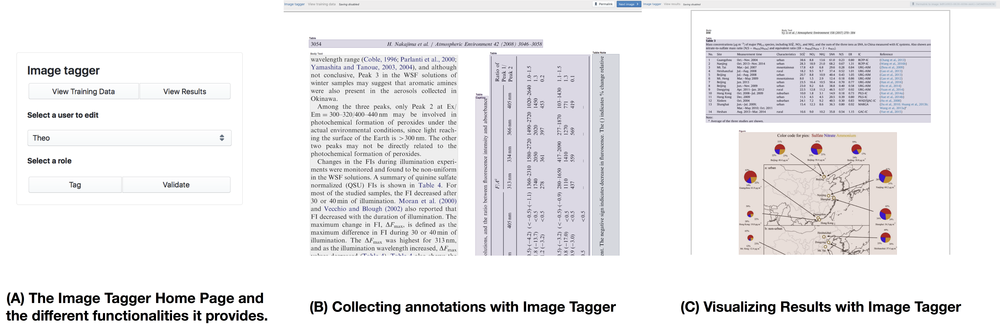
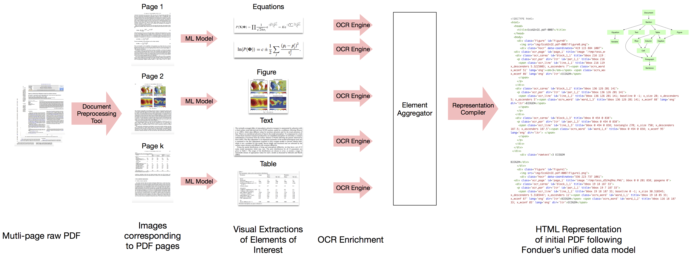
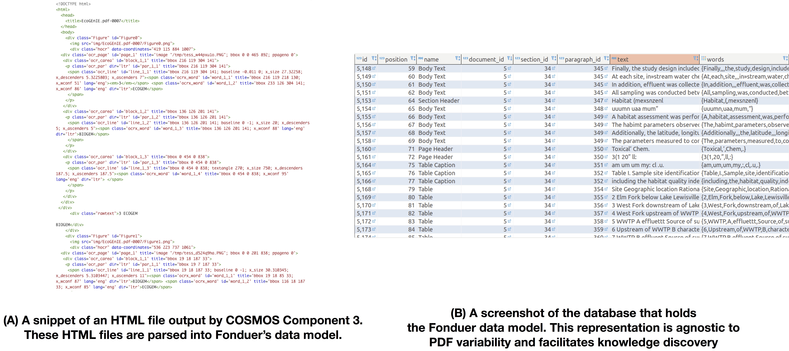
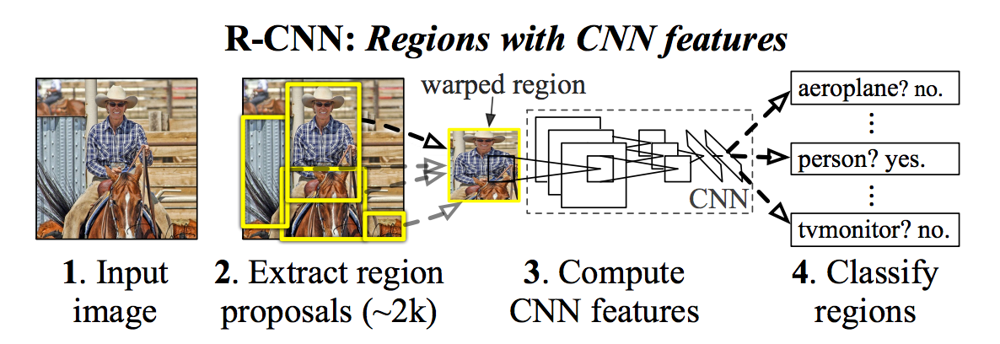
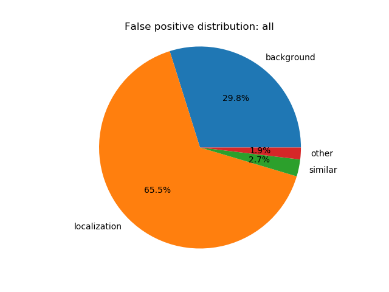
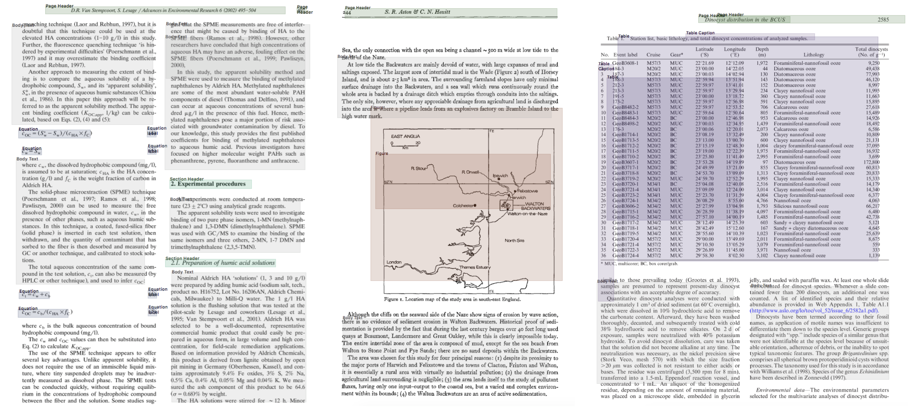
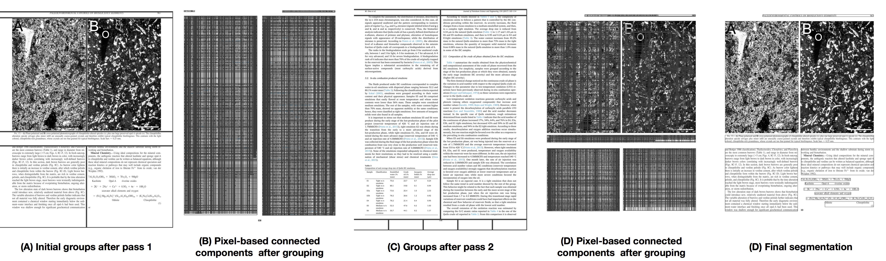

# ASKE Interim Report - UW Madison - COSMOS Project
### Organization/Date: UW - Madison, 02/01/2019
### PIs: Prof. Theodoros Rekatsinas, Prof. Shanan Peters, and Prof. Miron Livny

# 1 The COSMOS Project
The goal of the COSMOS project is to develop a prototype knowledge base construction system that will help automate the curation of scientific models. In this section, we introduce in more details the problems along the COSMOS pipeline that we address during Phase 1 of the ASKE program and describe the challenges associated with these problems. We also provide **an executive summary that outlines the design of the COSMOS system** and our achievements during the last three months of Phase 1, as well as **collaborations with members from TA2**. In Section 2 of this manuscript, we provide a technical description of the components in the COSMOS system.

## 1.1 Curation Of Scientific MOdelS (COSMOS)
The development, refinement, and assessment of scientific models that describe natural phenomena depends heavily on empirical and experimental data and observations reported in the text, tables and figures of scientific publications. The theoretical underpinnings of models and key model components are also commonly expressed in the form of equations and accompanying text-based descriptions. The ability to locate and assemble specific data and information relevant to a given scientific model from across hundreds, thousands, or even millions of publications, and do so in a way that keeps up-to-date as new publications are produced, is a major barrier to scientific progress. In addition to the sheer current quantity of documents, the submission rate of published documents in the scientific domain is also growing exponentially. This poses a real problem, since more and more information published in the PDF documents is going dark. In order to make the content of these documents searchable (e.g., find me a phase-diagram of material XYZ), one needs essentially two components. First, you need to ingest documents from a variety of formats (with the PDF format being the most prevalent one) and convert these documents to structured data files with a structured format such as JSON, XML or HTML. Second, you need a query engine that is able to deal with a large variety of concepts (documents, images, authors, tables, etc) extracted from these documents and put these into context. We are addressing both these issues in the first phase of the COSMOS project.

Here, we provide an interim report on the design and implementation of our prototype system for automatically locating and extracting from the published literature data and information pertinent to scientific models. Two primary tasks constituted the focus of this TA1 project milestone:

1. Model equation extraction from PDFs
2. Table/figure extraction from PDFs

Both of these tasks require the development and deployment of methods to automatically visually segment, classify, and represent heterogeneous elements (i.e., equations, tables, figures, captions, body text blocks) within PDF documents from multiple publishers in a way that maintains contextual relationships to text-based information. Extracted equation, table, and figure elements and text must then be represented in a way that can be used in inference steps (i.e., automated knowledge base construction). We focus functionality on PDF input because the majority of published data and information in many domains of science, particularly those with field-based observational data, are available primarily or exclusively in PDF formats.

Below, we first describe the general nature of the problem and our multimodal approach. Next, we document the software tools that we are developing and/or modifying to address the problem. We then provide initial experimental results demonstrating the validity of our approach for equation, table, and figure element extraction from full-text PDFs from multiple different commercial and open-access sources. The performance of our code and workflow and our ability to scale to multiple millions of documents in xDD infrastructure are also preliminarily assessed.

## 1.2 Objectives and Challenges
Our primary objective is to automatically recognize and visually extract fine-grained components from heterogeneous publications that correspond to text blocks, equations, equation labels, figure, figure captions, tables, and table captures. An example of such components and the manually annotated segmentation is shown in Figure 1. This visual excerpt from a PDF was annotated with our in-house image taggging tool [[1]](#ref1) and contains body text blocks, equations, equation labels, a figure, and a figure caption.

<p align ="center"></p>
<p align ="center"><b>Figure 1: A visual excerpt from a PDF with manual annotations using our image tagging tool. Such manual annotations are used to train the extractors used in the COSMOS system.</b></p>

Beyond recognizing and visually extracting all these components, we want to preserve explicit associations with text-based information. For example, Equation (33), in the above Figure, contains the variable *I<sub>av</sub>*, which is described in plain language in the underlying body text element. Similarly, the lowest body text block contains call-outs to specific equations [(8)-(10) and (15)-(17)] which identify them as *radical producing and consumption reactions.* This text-derived semantic description of equations is required to understand the phenomena and contexts to which they apply. Table and figure elements have analogous properties, and fully understanding their contents usually requires incorporation of information from associated captions. Labels for figures and tables (e.g., Fig. 7, Table 1) also relate the content to more complete semantic descriptions in body text. 

Ultimately, text, tables, figures, and equations must be parsed, read, and explicitly related to one another in order to create a knowledge base that can used to inform scientific models. Here, we consider a knoweldge to be a collection of relational tables, where each table corresponds to a relation in the knoweldge base. All these tables are stored in a relational database backend. We discuss the schema of these tables for the COSMOS project later in the docuemnt. The next Figure, shows an example of equation and text-entity recognition and tuple extraction suitable for representation in a simple knowledge base.   

<p align ="center"></p>
<p align ="center"><b>Figure 2: An example of using the visual segmentations to extract entries of (Equation Symbol, Description Term) relation in the COSMOS knowledge base.</b></p>

#### Overview of Technical Challenges
A major technical challenge in the COSMOS system is the enormous variability of scientific documents with resprect to data representation and layous. This makes it extremely challenging to access content and transform it into a representation that enables knowledge discovery. An example collection of heterogeneous documents is shown in Figure 3. As we discuss later, the methods we are developing in COSMOS are rebust to this variabilty in formatting, quality, and representation of the documents. Specifically, we propose a combination of compuer vision and natural language processing methods that can leverage multi-modal information available in the raw documents to obtain high quality results.

<p align ="center"></p>
<p align ="center"><b>Figure 3: Example PDFs with heterogeneous formats. As shown the documents range from noisy scanned PDfs to high-quality PDFs. Also elements, such as tables, show high variability with respect to their orientation and layout.</b></p>

Another major challenge in the COSMOS system is that of scalability. We are observing an exponential increase in the number of available scientific documents for ingenstion. The sheer amount of available data poses a significant challenge with respect to parallelization of computation and proper resource allocation. To address these issues the COSMOS systems adopts a microservises-based organization. Different microservices either communicate via REST APIs or produce and consume XML and HTML files whose elements are also persisted in a database backend. This approach not only allows us to build complex pipelines to process documents automatically, but also allows us to develop new microservices against the platform. In order to make this platform scalable, all microservices are integrated through asynchronous communication protocols by utilizing the xDD infrastructure, which gives us many benefits: It allows to do proper resource management, eliminates strong dependencies and makes the platform robust against single task failures. We discuss technical challenges associated with each component of COSMOS in more detail in Section 2, where we provide a technical description of each component. 

## 1.3 Executive Summary
This section summarizes the main components of the COSMOS system, our main achievements for the first part of Phase 1, and collaborations with ASKE teams from TA2. 

### 1.3.1 Infrastructure and Software Overview
We start with an overview of the COSMOS system and its main components. An overview is shown in Figure 4. There are four main computing infrastructure and software components in the DARPA TA1 COSMOS project:

1. Document fetching, storage, and pre-processing systems
2. Document annotation and training data acquisition
3. Document segmentation and segment classification
4. Fonduer-based model extraction

Component 1 is responsible for collecting, storing, and managing the raw data used as input in the COSMOS system. This component comprises of several micro-services as we describe below. The next component of COSMOS, Component 2, provides a micro-service that enables us to manually annotate input documents. The data output by this component is crucial to evaluate the quality of the results provided by the COSMOS system and also to collect training data for the next two components of COSMOS. Components 3 and 4 of COSMOS rely on state-of-the-art machine learning models to achieve their corresponding tasks. The necessary training and testing data for these components are collected via Component 2. 

<p align ="center"></p>
<p align ="center"><b>Figure 4: An overview of the COSMOS system and its connection to the xDD infrustructure. The document fetching, storage, and pre-processing component of COSMOS is already being used by the Harvard team (EMMAA) from TA 2</b></p>

Combining these components provides a cross-disciplinary platform capable of accelerating  the reproducibility and scalability of scientific research. It also provides an infrastructure for scientific model curation and knowlege base construction (Phase 2 objective of the COSMOS project). Below we describe the design and implementation of our prototype COSMOS system.


#### Component 1: Document Fetching, Storage, and Processing System
A key component of the infrastructure we are developing is an extension of the GeoDeepDive document acquisition, storage, and processing system [[2]](#ref2). This digital library and computing infrastructure, called **xDD**, is capable of supporting a wide range of activities that require information to be continuously located and extracted from published documents. Currently, xDD contains over 8.8 million documents, principally from journals and other serials, that have been published by a variety of open-access and commercial publishers. Documents in xDD span all domains of science and biomedicine and the library continues to grow by some 8K documents daily. As a result, xDD is currently the single largest source of published scientific information that can be leveraged by multiple, collaborating teams. A summary of the document aquisition trace in xDD is shown in Figure 5.

<p align ="center"></p>
<p align ="center"><b>Figure 5: A summary of the document aquisition trace in xDD. xDD is being leverages by the COSMOS projec the the EMMAA project by the Harvard Team (TA 2).</b></p>

The distinguishing characteristics of the COSMOS xDD infrastructure are our ability to:

1. Continuously acquire and store PDF documents and bibliographic metadata from partnered publishers.
2. Extract and index the text layer from the PDF documents, allowing rapid discovery of relevant literature.
3. Rapidly process all stored documents via the over quarter million CPU hours that are available daily on UW-Madison's Center for High Throughput Computing (CHTC) cluster.

Because access to a large collection of documents, and the computing capacity required to parse and extract information from them, is foundational to any activity that seeks to automate the utilization of published scientific information, we are well-positioned to succeed and to contribute to the success of other ASKE teams. For example, we are already collaborating with PI Peter Sorger and the TA2 EMMAA project by deploying elements of their current pipeline on our larger xDD and COSMOS system. The work of other ASKE team members that depends on access to the published literature may also benefit in ASKE Phase 2.

#### Component 2: Collection of Training Data and Annotations
Access to manually annotated data is critical to train the COSMOS system and to evaluate its performance. Due to the lack of flexible, open-source image tagging software oriented for the web, we developed an in-house system to collect, validate, and visualize training data for our models. The system is composed of two loosely-coupled components: (1) Image Tagger [[3]](#ref3), which is a *React*-based frontend component for displaying the location of tagged bounding boxes atop an image (here, a page of text), and (2) the Image Tagger API [[4]](#ref4) which is a webserver component that provides bounding boxes to Image Tagger and permits the collections of training data from the frontend into an SQLite database. Figure 6 shows screenshots of the functionalities provided by Image Tagger. Both Image Tagger and the Image Tagger API are open-source and extensible software components that are useful both within and beyond the model pipeline discussed here.

<p align ="center"></p>
<p align ="center"><b>Figure 6: An overview of the different functionalities supported by the COSMOS Image Tagger.</b></p>


To date, we have collected annotations for 2,079 pages from a random collection of xDD documents that mention the terms "model", "equation" and "total organic carbon" (a common measurement used to characterize sediment in many different contexts). Within these 2,079 pages we have collected 19,417 bounding boxes and labels. Of these, 5,674 (29%) are body text, 2,990 (15%) are text section headers, 1,306 (7%) are figures, 1,123 (6%) are equations, and 782 (4%) are tables. Table/figure captions, references and other elements constitute the remaining 39% of the labels acquired thus far.

In addition to allowing us to generate and validate training data, the Image Tagger frontend supports the visualization of arbitrary bounding boxes atop a page and forms the core of a system for visualizing output from the model pipeline. To this end, a modified Image Tagger API serves model output in a "View" mode, allowing inspection of model results.

To train models for integrating equation data, the next milestone will expand Image Tagger to incorporate the capture of relational information, such as the links between variables in an equation and in text. Further evolution of the rest of the model pipeline will include more seamless and automated integration of Image Tagger to view various process endpoints.

#### Component 3: Visual Extraction of Tables, Figures, and Equations
This component is responsible for processing the PDFs collected from Component 1 and converting the raw PDF in an HTML representation with fine-grained information about different elements of the raw input PDF. These elements correspond to the classes described above, i.e., text components, tables, figures, equatins, section headers, etc. In addition to the visual segment that corresponds to each identified element the HTML representation of a raw PDF extracted from this component contains any text-based information contained in these elements. For example, for a figure that contains a plot we not only extract the image corresponding to the figure but also the text informaiton in the axis of the plot or the plot's legent. All this informatin together with the image correpsonding to the figure are stored in the final HTML output. To constuct the desired HTML output we combine techniques from *object detection* in image data and *optical character recognition* (OCR). The final HTML representation can be used for knoweldge discovery as it is angostic to formating and layout variations of input PDFs. An overview of Component 3 is shown in Figure 7. We briefly describe each part of ouf Component 3.

<p align ="center"></p>
<p align ="center"><b>Figure 7: An overview of how object detectin is combined with OCR to convert a raw PDF into an HTML representation that can be used for knoweldge discovery. Object detection and OCR are executed in parallel for each page of a raw PDF.</b></p>

As shown in Figure 3, each PDF is split into a collection of images, where each image corresponds to one page of the raw PDF. This pre-processing step is performed by Component 1 of the COSMOS system. Given these images, we first detect objects of interest in them, visually extract these objects, and perform OCR to extract any contained text. For the object detection step, we adopt a popular model from the computer vision community, Faster-RCNN (F-RCNN) [[5]](#ref5). Primarily used for identifying 3D objects in scene images, Faster-RCNN uses specialized convolutional neural networks to first output many regions of interests within a scene, and then classifies each region of interest. Our adaptation of this model solves the issue of domain transfer; while the out-of-box model is built to handle 3D, densely populated images, our adaptation specifically handles 2D, sparse images [[6]](#ref6). We identify that the core problem with the original model is that it is unable to produce accurate bounding box predictions over our documents (as we demonstrate in Section 2). To mitigate this issue, we replace the regions of interest that the neural network proposes and instead use a grid proposal system. Because we know that 2D documents are typeset and regular, we utilize the fact that white space is used as visual separators to divide the papers into a grid. For each cell in the grid, we find all connected pixel regions, then draw a bounding box over the boundary connected regions [[7]](#ref7). We then project the F-RCNN proposals onto the grid-based proposal to obtain labels such as body text, equations, tables, etc.

With the elements, their types, and their layout generated (and stored in XML files), we move to the next step in the extraction pipeline: text extraction. For each element, we pass an image of that element into a specified text extractor. Here, we differentiate, between equation elements and other elments. For all elements that do not correspond to equations we use the OCR engine Tesseract [[8]](#ref8). However, Tesseract fails to produce meaningful output text for equations that were passed in. Not only was the quality poor, but the output was not a latex representation, and as such we were discarding important visual information we could utilize down the line during model extraction. To handle this issue, for all equation images we deploy a state of the art latex extractor developed by the NLP group at Harvard [[9]](#ref9). This latex extractor uses an attention-based neural network to translate an image representation into a latex representation. Here, we found the out of box extractor did not generalize to latex images that were not produced in the same way as the dataset it was trained on. Because many of our documents are scanned in, misaligned, noisy, or all of the above, we retrain the model to produce our desired output [[10]](#ref10).

Finally, we collect all elements and the information collected into an html document. These HTML documents are read into a queryable PostgreSQL database, conforming to the schema required for Fonduer model specification.

#### Component 4: Model Extraction

The last component of the COSMOS system is responsible for ingesting the HTML documents produced by Component 3 and aims to organize and store the text, table, figure, and equation information for each PDF into a unified data model that can be used by our Fonduer Knowledge Based Construction (KBC) engine [[11,12]](#ref11). For our task we have extended the initial Fonduer data model to accomodate equations. An overview is shown in Figure 8. 

<p align ="center"></p>
<p align ="center"><b>Figure 8: The schema of the extended Fonduer model used to represent PDFs containing text, tables, figures, and equations.</b></p>

All HTML files generated by Component 3 are parsed into Fonduer's data model via a specialized parser that we have developed [[13]](#ref13). An example of an input HTML file and a snipet of the data base generated after parsing these HTML files are shown in Figure 9. 

<p align ="center"></p>
<p align ="center"><b>Figure 9: An example of how PDF files are stored in Fonduer's data model. The resulting representation is agnostic to PDF variability and ready to consumed by knoweldge discovery applications.</b></p>

Given the data representation presented above, the next step of Component 4 is to perform cross-reference resolution for the extracted PDF elements, i.e., identify parts of text such as noun phrases that refer to entities associated with the extracted tables, equations, and figures. In Phase 1, we focus on solving the problem of cross-reference resolution for equations. Figure 10 shows an overview of the approach we follow to extract model components such as variables from equations and construct a knoweldge base as the one shown in Figure 2.

<p align ="center"></p>
<p align ="center"><b>Figure 10: An overview of the COSMOS service for extracting knowledge from equations.</b></p>

Our pipeline for extracting model components from equations proceeds in the following steps: (1) Each equation is associated with an image and a latex extraction provided by Component 3. (2) Given this as input our service parses the latex code into an abstract syntax tree and uses that tree to generate a set of candidate symbols that correspond to variables which describe scientific quantities. Notice, that the abstract syntax tree also encodes how these different quantities are related (i.e., it encodes the mathematical relations between the identified variables). We provide an exampl in this Jupyter Notebook [[14]](#ref14) (3) The candidate symbols that correspond to quantities of interest are given as input to a disambiguation engine that matches some of these candidate quantities to text-spans in the text parts of the input PDF. For now, we utilize the spatial information encoded in the HTML representation of a PDF and focus on text spans that are in close proximity with the equation from which the candidate quantities are extracted. We plan to relax this assumption. The output of this step is a set of symbols that correspond to scientific quantities (entities, constants, etc) references in the text of a PDF. (4) The final step is to solve a relation extraction problem with our Fonduer engine. Given a text span that corresponds to the sumbol of a scientific quantity we identify and extract a text span that corresponds to a noun phrase that describes this quantity. The extracted relation instances are stored in a separate database table as shown in Figure 10. By the end of Phase 1, we plan to extend this pipeline to tables and figures.

### 1.3.2 Collaborations

We have arlready initiated a close collaboration with the TA2 EMMAA Team (PI Peter Sorger) from Harvard. The goal of this collaboration is for the EMMAA team to use the technology developed in xDD and COSMOS to obtain data for the TA2 EMMAA project.

# 2 Technical Overview
We now review in detail several of the points discussed in the previous section. We start by providing more details on document fetching and storing, and then provide details on the visual extraction and model extraction components of the COSMOS system.

## 2.1 Running COSMOS on the xDD Infrastructure 
We first provide a description of the data storing and processing backend of the COSMOS system as well as metrics on the throughput and perormance of our system.

### 2.1.1 Document Fetching and Storing
Enabled by project-specific agreements with publishers, negotiated by the University of Wisconsin Libraries, xDD acquires and stores PDF versions of a large corpus of academic literature. Each agreement is negotiated to permit key functionality, notably the ability to securely store copies of published documents (PDFs) and bibliographic metadata for internal processing. Outside users have access to full bibliographic citation and DOI information, with ULRs directing to the content on the publisher’s own platforms. As per our license agreements, data products sourced from the original PDFs, described below, are provided to users, and form the basis of user-directed research projects.

Data enters the xDD Infrastructure via the fetching process on a secure storage machine. This is a two-step process: First, the bibliographical metadata (including URLs to the PDF document) from publishers is downloaded, either through publisher-provided means (files, API) or via a third party system (such as CrossRef [[15]](#ref15). Second, a PDF document fetcher read this data back out using a separate process, downloading the documents from the stored URL, and stores the PDF (along with a JSON dump of the metadata) to the local file system, backed up nightly.

Once a document is fetched and its pdf is stored, its metadata is pushed into a central mongoDB repository. At this point, the text layer is extracted from the text via poppler's pdftotext tool [[16]](#ref16). The text is made searchable via ElasticSearch and is used as an initial starting point for some text-based processing pipelines within xDD (such as application of Stanford's CoreNLP or Google's word2vec).

Although exact document acquisition allowances and interfaces vary between publishers, several criteria and objectives are shared between them. The software components of xDD's fetching system are designed to be general, with as little as possible being customized for each publisher. Shared implementation includes:

  - Mechanisms for download rate management.
  - Metadata acquisition via CrossRef.
  - Document download, storage, and data integrity components
  - Database interfacing
  - Prioritization

The xDD infrastructure also supports secondary document collections, which are stored and processed alongside the primary corpus but accessible only to specific researchers. Use cases for these auxillary corpuses include researchers who have their own data they wish to be processed using the xDD processing pipelines ("bring-your-own-data" model) or corpuses with fundamentally different document structures (e.g the complete set of PubMed abstracts).

### 2.1.2 Document processing
The computational backbone of xDD is UW-Madison's Center for High-Throughput Computing (CHTC) [[17]](#ref17), utilizing the HTCondor scheduling software [[18]](#ref18). CHTC provides a large number of shared computing resources to researchers, with thousands of computing nodes serving up millions of hours of CPU time each year to hundreds of different projects. The high-throughput computing model is one in which the primary goal is maximizing overall throughput of a collection of tasks, each of which is computationally independent. The document processing requirements of xDD perfectly fits the model: applying a set of processing tools (Stanford's CoreNLP, a segmentation model, OCR) to a huge collection of documents results in millions of decoupled independent computing tasks. The integration between XDD and CHTC strives to:

1. Support rapid deployment of new tools against the corpus.
2. Convert the PDF documents into data usable for a variety of text/datamining (TDM) analyses.
3. Provide a standardized set of useful TDM products.

The primary goal of supporting rapid deployment of new tools against the corpus is accomplished by creating a configuration-based system that:

1. Defines the computational task in a language that CHTC understands (creating _submit files_ and defining _jobs_ in HTCondor's vocabulary)
2. Defines a subset of documents/data products to operate on.
3. Gathering the requisite components and submitting the jobs to the CHTC system.
4. Updates the central metadata database with information about the documents' processing

The implementation is designed to be flexible, allowing a wide variety of tasks to be defined and run (examples: running custom font-recognition scripts on all documents that have already been OCRed within the system, or applying a segmentation model to a relevant subset of earth science PDFs). CHTC and the HTCondor software allow a wide variety of critical job configurations, including Docker/singularity support, enforcing the directories be encrypted (so that the PDFs are never outside of the job while running on CHTC), and workflow automation.

### 2.1.3 Hardware and Uses

The xDD document storage and acquisition system is comprised of six dedicated machines that serve the following roles:

1. Data acquisition, storage, and backup
2. Job submission interface into CHTC
3. One machine for dedicated storage of processing output
4. Two machines for database hosts.

The xDD system is connected to the COSMOS ASKE infrastructure, which is comprised primarily of 3 machines with advanced computing capabilities required to train models and perform inference tasks:

**cosmos0000:** Research machine for hosting lightweight tasks, data, and services.

| CPU  | Cores  | Speed  | RAM  | Disk  | Disk (used)  |
|---|---|---|---|---|---|
| VM  | 8  | 2.30GHz | 64GB  | 1TB  | 100GB |


**cosmos0001 and cosmos0002:** Dedicated GPU machines for model training and research experiments.

| CPU  | Cores  | Speed  | RAM  | Disk  | Disk (used)  | GPU |
|---|---|---|---|---|---|---|
| Intel(R) Xeon(R) Gold 6148 CPU | 160  | 2.40GHz | 512GB  | 1.5TB SSD, 1.5TB HDD  | - | Nvidia Tesla V100 32GB |

### 2.1.4 Throughput and Performance
The current xDD pipelines regularly utilize on the order of 5,000 CPU hours per day on CHTC. This utilization represents the 'steady-state' CPU requirement of xDD, including only the running of the daily fetched documents through the standard (OCR, coreNLP) pipelines.  Past sprints have pushed xDD CHTC usage over 50,000 CPU hours utilized in a day, and it is not uncommon for CHTC to provide upwards of 100,000 hours of CPU to a user in a day.

Early experiments with a prior segmentation model are positive, with the infrastructure easily supporting simultaneous application of the model to thousands of documents in un-optimized CPU-only trial runs. Initial tests suggest that this version of the segmentation process requires on the order of one CPU minute per page processed. With a an average of around 12 pages per document, this corresponds to an overall throughput of 5 documents per CPU-hour. Because CHTC is a shared resource, it is difficult to predict daily availability and usage, but historical results indicate that a daily document throughputs of 25,000-100,000 documents should be expected. Both internal (code-level) and external (CHTC resource request) optimization is expected to improve overall throughput.

## 2.2 Visual Extraction of Tables, Figures, and Equations
We now describe the parts that comprise the visual extraction component of the COSMOS system. We also provide initial experimental data after evaluating our approach on data collected via Image Tagger (see Section 1.3.1).

### 2.2.1 Background: Region Convolutional Neural Networks

Our extraction model is based on Convolutional Neural Networks (CNNs) and specifically on architectures that combine Regions with CNNs (R-CNNs)[[5]](#ref5). An example of an R-CNN architecture is shown in Figure 11. RCNN-based architectures are the state-of-the-art in image segmentation and object recognition.

<p align ="center"></p>
<p align ="center"><b>Figure 11: An example of an R-CNN applied to regular images that do not correspond to documents.</b></p>

Our visual extraction is based on RCNNs. We started by applying an out-of-the-box RCNN network to our task[[19]](#ref19). We trained and evaluated this network on data collected via our Image Tagger tool. We used standard metrics (based on the COCO benchmark [[20]](#ref20) to evalute the performance of this network: (1) **Intersection over Union (IoU, IU)**, is a common way to determine if an object proposal is correct. This takes the set $$A$$ of proposed object pixels and the set of true object pixels $$B$$ and calculates the ratio $$IoU = \frac{A \cap B}{A \cup B}$$. Commonly, $$IoU > 0.5$$ means that an object proposal is valid, otherwise it is invalid. For each class, one can calculate: (1) a *True Positive* as $$TP(c)$$: a valid proposal was made for class $$c$$ and there was actually an object of class $$c$$; (1) a *False Positive* as $$FP(c)$$: a valid proposal was made for class $$c$$ and there was not an object of class $$c$$; (3) the *Average Precision* for class $$c$$ as $$AP(c) = \frac{TP(c)}{TP(c) + FP(c)}$$. The *mean average precision* ($$mAP$$) is calculated as $$mAP = \frac{1}{|class|}\sum_{c \in Classes} AP(c)$$.

Using these metrics we find that applying RCNNs naively to our problem achieves an $$mAP = 0.887$$. Looking carefully to the Tables, Figures, and Equations classes we found that the Average Precision was $$0.888$$, $$0.734$$, and $$0.723$$ respectively. A more detailed analysis of the false positives revealed that the most prominent source of error was related to *localization errors**, i.e., bad bounding boxes of the extracted objects. Figure 12 shows a breakdown of different error types for false positive. As shown using RCNNS that are tailored to images with no specific structure suffers from severe localization issues when applied to documents, which exhibit significant structure.

<p align ="center"></p>
<p align ="center"><b>Figure 12: Breakdown of the false positive achieved by using an out-of-box implementation of RCNNs for the COSMOS extraction task. `Localization' refers to errors due to bad object bounding boxes, `Background' to errors due to mixing background with a class, and `Similar' to errors due to confusion amongst similar classes (e.g., table caption with text or table).</b></p>

<p align ="center"></p>
<p align ="center"><b>Figure 13: Example extractions obtained by applying RCNNs tailored to generic images to our visual extraction task.</b></p>

Using Image Tagger, we evaluated individual extractions to identify the severity of the location errors. Figure 13 shows examples of visual representations of such localization errors. The first picture demonstrate localization errors with text, the second with a figure, and the third with a table and its caption. Despite the localization errors we see that the class assignment is correct. We extend the standard RCNN pipeline to address these location errors.

### 2.2.2 The COSMOS Visual Extraction Model
We describe the visual extraction model we use in COSMOS to address the localization errors of RCNNs presented above. Specificallt, we replace the regions of interest that the neural network proposes and instead use a grid proposal system. Because we know that 2D documents are typeset and regular, we utilize the fact that white space is used as visual separators to divide the papers into a grid. The stages of our model are as follows:

1. Proposal generation via grid proposal algorithm
2. Preprocessing of image
3. Feature extraction via residual neural network
4. Proposal classifier consider RCNN output and grid proposal
5. Combine RCNN classification with grid-based proposal
6. Run optical character recognition (OCR) module over extracted regions
7. Consolidate region coordinates, class, and extracted text into HTML file

#### Proposal generation via grid algorithm

We begin the extraction pipeline by first producing grid-based region proposals. As demonstrated before, the regio proposal neural network from the out-of-the-box RCNN, which automatically detects regions of interest for scene images, does not suit the task of page element detection. The produced proposals often did not encapsulate a majority of any single element, and also would cross over into neighboring elements, which would create noise later in the OCR stage of the pipeline.

We utilize the fact that scientific papers are generally divided into a grid like structure to motivate an algorithmic replacement for region proposals, which we call the grid proposal algorithm. Given a png image as input, the initial step is to first transform the $$3 \times N \times M$$ image into an $$N \times M$$ binary matrix, where an element in the matrix is $$1$$ if the corresponding pixel in the original image is not white, and $$0$$ if it is.

Given this binary matrix, we iterate over the matrix column-wise and find the top and bottom coordinates of all blocks consisting of only 0 and are of at least size $$K \times M$$, where $$K$$ is an adjustable parameter (we set $$K = 25$$) and $$M$$ is the width of the image. The space in between each of these white space blocks are our initial rows.

For each of these initial rows, we attempt to determine the number of columns $$C$$ within the row. We enumerate $$C$$ from 1 to 5, and check each of the column positions for an $$H x W$$ vertical block of whitespace, where $$W$$ is a set parameter (we set $$W$$ to 10) and $$H$$ is the height of the block. Each column position is the appropriate fraction of the row. For example, if $$C=4$$ we check if the whitespace block exists $$\frac{1}{4}$$, $$\frac{1}{2}$$, and $$\frac{3}{4}$$ of the way through the row. We then take the max $$C$$ that successfully partitions the row. We then divide the row into blocks according to the column separations.

For each block, we run the row division procedure once more, with a slightly more fine grained whitespace partition. This is our final grid.

For each cell in the grid, we next refine the cell's proposal. Given a cell, we find all 8-connected components of a certain size within the cell. An 8-connected component is a contiguous region of pixels for which each pixel is tangent to another pixel in at least one of the surrounding eight pixel locations. To find the components, we employ a standard two pass algorithm.

<p align ="center"></p>
<p align ="center"><b>Figure 14: An example demonstrating the different stages of our grid proposal algorithm.</b></p>

In the first pass, a breadth first search is conducted to assign initial groups to each pixel. For each positive pixel, the north, northwest, northeast, and west pixel are checked. If none of the neighbor pixels are associated with a group number, assign a new group to the current pixel. If the neighboring positive pixels are associated with the same group, assign that group to the current pixel. If the neighboring positive pixels belong to different groups, record the groups as equivalent in a hash table and assign one of the groups to the current pixel.

In the second pass, the hash table is used to merge groups. Again, breadth first search is used. For each pixel, its group is checked in the hash table for equivalence, and if a suitable equivalence exists, its group number is changed.

Finally, we take each group's bounding box to obtain the connected component. We filter these components based on a minimum size. Then for each cell, we produce a bounding box over the left, top, bottom, and rightmost components in the connected components set. This is our final region proposal for the cell. For each cell, we write its updated region proposal to disk.

#### Preprocessing and Feature Extraction

We preprocess each image to fit the input dimensions of our backbone residual neural network (ResNet)[[21]](#ref21) used to implement our RCNN architecture. We set the input to our ResNet to accept images of size $$1920 \times 1920$$, so for each image we pad each size until they fit those dimensions. We then perform feature extraction over our input images. For feature extraction we use a residual neural network (ResNet), which is a type of convolutional neural network (CNN) designed to better approximate the input-output mapping better than other CNNs.

The task of feature extraction is finding a lower dimensional, more meaningful representation of the input that downstream tasks such as image classification and page element detection can utilize to better perform their tasks. Subsequently at each layer in our feature extraction CNN, we aim to learn the identity mapping $$H(x) = x$$. The simple intuition behind ResNet is that it is much easier for the internal layers to learn the function $$F(x) = 0$$, and then add the identity mapping afterward. Then, $$H(x) = F(x) + x$$. In practice, after a set amount of convolutional layers we simply add the input to the output of those set layers. In addition, ResNet makes use of batch normalization after each layer. Batch normalization normalizes the activations of each layer according the the activations' mean and standard deviation. It's not clear why batch normalization is effective theoretically, but empirically it has shown to

We utilize ResNet-101, which is a 101 layer Resnet. We initialize the network with weights trained on ImageNet. While ImageNet does not contain any images of documents, its initialization is a good starting point. Training the ResNet from scratch would require an order of magnitude more images than what we have available. We discuss training below. 

#### Proposal Classifier

At this point, we have produced a convolutional feature map of the entire input image, as well as the region proposals. We now want to classify each proposal. To do so, we first must map the convolutional features from the entire image to the specific area the region proposes. We utilize the ROI Align method [[22]](#ref22).

ROI Align is a direct successor to the ROI Pool method proposed in Fast-RCNN[[23]](#ref23). ROI Pool was first proposed as a way to associate convolutional features with proposals of any size. For each region proposal, the proposal is divided into some $$H \times W$$ bins. Each bin is then mapped to the corresponding block of the convolutional feature map. We now perform a max pool operation over each convolutional block, which means that we take the maximum value in the block and return it. Consequently, for a region of interest of any size we return a feature map of size $$H \times W$$.

The problem with ROI Pool is that the max pool operation discards a lot of potentially important information in the convolutional feature map. ROI Align is a simple extension of ROI Pool, where instead of the max pool operation we instead sample four random points in the convolutional bin, then perform bilinear interpolation over the points to return a single value. ROI Align has been shown to preserve convolutional features slightly better than ROI Pool. We now feed the mapped $$H \times W$$ feature map into a classification neural net, which finally outputs the class of the region of interest.

#### Training the neural network

We train the entire network from end to end. We use the Adam optimizer and heavily utilize L2 regularization. We also utilize dropout. We address the large class imbalance (for example, there is much more body text than any other class) by forcing each class to be sampled equally during training.

We augment the annotated data collected via Image Tagger with 2417 images annotated in the ICDAR POD 2017 competition. These images are only annotated with tables, equations, and figures. Because we are primarily concerned with training our classification network and not automatically producing region proposals, the lack of annotations of other classes in those images does not affect the training. We only train our network on the regions of interests for which there is a matching ground truth box for that image. We are continuously collecting more annotations and we are planning to devise weak supervision techniques to increase the amoun of training data available to our network.

#### Preliminary Evaluation

We report a preliminary evaluation of our extensions. First, we evaluate the bounding boxes reported by our grid-based proposal algorithm. We consider the metric of IoU and measure precision and recall (in an information retrieval notion) considering as true positives valid regions proposed by our algorithm. We find our bounding box precision to be 0.914, recall to be 0.896, and F1 to be 0.90. We further examine classifications obtained by our method using Image Tagger. 

<p align ="center"></p>
<p align ="center"><b>Figure 15: Example classifications after combining R-CNNs with our grid-based region proposal algorithm.</b></p>

Figure 15 shows a few examples of classifications obtained after combining the R-CNN architecture described above with our grid-based region proposal algorithm. As shown the bounding boxes have improved significanlty, while we maintain high precision for the different class assignments.


## 2.3 Model Extraction

The variable extractor aims to collect variable candidates from Latex expressions. Our implementation is built upon _Katex_ [1], a Javascript framework that facilitates efficient mathematical equation rendering in web browsers. Before we start parsing the Latex expression generated by the OCR engine, we perform several preprocessing steps that ensure the output Latex expression is valid to the _Katex_ parser. The preprocessing steps include replacing parenthesis with braces, removing Latex command `/mathml`, removing extra parenthesis, and removing unnecessary empty spaces. Given an abstract syntax tree in the format of MathML [2] from the _Katex_ framework, our parser performs a depth-first search on the resultant parse tree to collect all subtree of the tag `<mrow>`, `<msub>`, `<msup>`, and `<mi>`.  `<mrow>` represents a horizontal row of items. `<msub>` and `<msup>` mean the semantic of subscript and superscript respectively. `<mi>` is defined as the identifier element. Since an important goal of our parser is to preserve the subscript and superscript semantic of a given variable, it is critical for the implementation to correctly record the existing structure in `<msub>` and `<msup>`. Furthermore, when parsing the subtree in `<mrow>`, a row wrapper of many MathML expressions, in order to successfully parse variable name with more than one characters, we collectively join the body text inside all consecutive `<mi>` as in the _Katex_-generated parse tree `<mi>` is designed to only contain one character per tree node. Lastly, we implement an unparse method that normalizes and produces a uniform string representation of the parse tree structure of a variable. Since it is possible that different Latex expressions can have the same semantic, namely `a_b` and `{a}_{b}`, our unparse method will serve as an integral part toward organizing and extracting knowledge across equations and its surrounding text.           


[1] https://katex.org/   
[2] https://en.wikipedia.org/wiki/MathML

#### The parsing pipeline, the bridge between Cosmos and Fonduer

As the first step of bringing segmentations into a unified data format that preserves the semantic structure of a document, we utilize the pixels coordinates of each segmentations and reconstruct the extracted components into an HTML file as shown below.
```html
<!DOCTYPE html>
<html>
  <head>
    <title>10.1080_00103620600561071.pdf-0004</title>
  </head>
  <body>
    <div class="Body Text" id="Body Text0">
      
      <div class="hocr" data-coordinates="216 308 1138 1251"></div>
    </div>
    <div class="Equation label" id="Equation label3">
      
      <div class="hocr" data-coordinates="1005 1181 1104 1232"></div>
    </div>
    <div class="Equation" id="Equation2">
      
      <div class="hocr" data-coordinates="597 1183 832 1236">
    </div>
    <div class="Equation" id="Equation1">
      
      <div class="hocr" data-coordinates="592 1347 814 1429"></div>
    </div>
   </body>   
</html>
```

Next, we extend the existing document parser from the [Fonduer](https://github.com/HazyResearch/fonduer) framework so that it can properly parse the HTML document generated by our system. Several extensions include (1) The ability to parse equations and extract variable tokens. (2) The ability to record classifications of each sentence appeared in the documents. For example, a sentence in a document can either be classified by the previous stage as document header, body text, image caption, and etc. It is important to store the additional information into our unified data model (Figure 1) since this will enable our downstream machine learning application to consider the relationship between different components in a document.

After recovering the document structure from segmentations, we utilize existing OCR framework to convert the image of body text and equations to machine-readable format. The image of body text is converted to plain text via [Tesseract](https://opensource.google.com/projects/tesseract) and the image of an equation is converted to latex code via a [neural encoder-decoder model](https://arxiv.org/pdf/1609.04938v1.pdf).

Lastly, our parser will take the HTML file and the output from the OCR engines as input and populate a PostgreSQL database according to the schema as shown in Figure 1.

#### Next step
We will extend our current pipeline and add in components to achieve the full workflow of equation extraction as shown in Figure 2. As a next step, we aim to construct knowledge bases that can offer useful information about different components of the scientific models based on the unified data model that we have structured in this stage.  
<Figure>

<figcaption>Figure 2. The complete workflow for equation extraction.</figcaption>
</Figure>

#### Resources
* [Link](https://github.com/UW-COSMOS/COSMOS-Parser) The code of parser that organizes and inserts the segmentations into a relational database.
* [Link](https://github.com/guillaumegenthial/im2latex) The implementation we used for converting image of equation to latex code.
* [Link](https://github.com/UW-COSMOS/latex-parser/blob/master/Equation%20Extraction%20Workflow.ipynb) An example of the equation extraction workflow.

# 3 Conclusions and Next Steps

We have described a prototype system to visually, using convolutional neural networks, locate and extract equations, tables, figures, and text objects from heterogeneous PDF documents and then represent them in a unified data model that can be used by our Fonduer Knowledge Base Construction engine [[11,12]](#ref11). Our prototype is deployed on xDD infrastructure, which uniquely provides us instant access to more than 8.8 million PDFs from multiple commercial and open-access publishers, as well as a continuous stream of approximately 8K additional documents per day, with additional new publisher access being added in the future. Preliminary results demonstrate the feasibility and scalability of this system. The computing capacity provided by xDD's deployment on the UW-Madison CHTC cluster allows us to rapidly scale-up and keep downstream knowledge bases and applications supplied with new data in near real-time, as the scientific literature is produced.

Our next steps involve finalizing the visual document processing pipeline and deploying it on xDD for continuous ingestion of  documents specifically relevant to the cGENIE model. Note that none of our fundamental components, including both xDD and our visual PDF segmentation and extraction pipeline, are tuned to be scientific domain-specific. Thus, cGENIE is serving only as test-bed for validating our methods and demonstrating an ability to close-the-loop and facilitate new scientific research in a complex domain of Earth systems science that depends on heterogeneous observational and experimental data as well as theoretical and first-principle models of natural systems. Building and releasing barebones knowledge bases that contain multimodal information from ingested documents and supporting on-demand construction of such knowledge bases for specific scientific model applications is the task of our next project Milestone.

Finally, we plan on preparing several publications based on our prototype systems. Specifically, we aim for two submissions on the Application/Data Tracks of the Conference on Uncertainty in Artifical Intelligence (UAI) 2019 and NeurIPS 2019.

# 4 References

#### <a id="ref1"></a> [1] COSMOS Image Tagger [https://github.com/UW-COSMOS/image-tagger](https://github.com/UW-COSMOS/image-tagger)
#### <a id="ref2"></a> [2] GeoDeepDive Project [https://geodeepdive.org](https://geodeepdive.org) 
#### <a id="ref3"></a> [3] COSMOS Image Tagger [https://github.com/UW-COSMOS/image-tagger](https://github.com/UW-COSMOS/image-tagger)
#### <a id="ref4"></a> [4] COSMOS Image Tagger API [https://github.com/UW-COSMOS/image-tagger-api](https://github.com/UW-COSMOS/image-tagger-api)
#### <a id="ref5"></a> [5] Ren, Shaoqing, et al. Faster R-CNN: Towards real-time object detection with region proposal networks. <i>Advances in neural information processing systems.</i> 2015.
#### <a id="ref6"></a> [6] COSMOS RCNN [https://github.com/UW-COSMOS/mmmask-rcnn](https://github.com/UW-COSMOS/mmmask-rcnn)
#### <a id="ref7"></a> [7] Grid-based Bounding Box Discovery [https://github.com/UW-COSMOS/mmmask-rcnn/blob/master/model/connected_components/connected_components.py](https://github.com/UW-COSMOS/mmmask-rcnn/blob/master/model/connected_components/connected_components.py)
#### <a id="ref8"></a> [8] Tesseract OCR [https://github.com/tesseract-ocr/tesseract/wiki](https://github.com/tesseract-ocr/tesseract/wiki)
#### <a id="ref9"></a> [9] Image to Latex by the Harvard NLP group [http://lstm.seas.harvard.edu/latex/](http://lstm.seas.harvard.edu/latex/)
#### <a id="ref10"></a> [10] COSMOS Latex OCR [https://github.com/UW-COSMOS/latex-ocr](https://github.com/UW-COSMOS/latex-ocr)
#### <a id="ref11"></a> [11] Wu, S., Hsiao, L., Cheng, X., Hancock, B., Rekatsinas, T., Levis, P. and Ré, C., 2018, May. Fonduer: Knowledge base construction from richly formatted data. <i> In Proceedings of the 2018 International Conference on Management of Data</i>, SIGMOD. 2018
#### <a id="ref12"></a> [12] Fonduer Repository [https://github.com/HazyResearch/fonduer](https://github.com/HazyResearch/fonduer)
#### <a id="ref13"></a> [13] HTML to Fonduer data model parser  [https://github.com/UW-COSMOS/COSMOS-Parser](https://github.com/UW-COSMOS/COSMOS-Parser)
#### <a id="ref14"></a> [14] Candidate variable generation from scientific equations [Jupyter Notebook](https://github.com/UW-COSMOS/latex-parser/blob/master/Equation%20Extraction%20Workflow.ipynb)
#### <a id="ref15"></a> [15] Crossref [https://www.crossref.org](https://www.crossref.org)
#### <a id="ref16"></a> [16] Crossref [https://poppler.freedesktop.org/](https://poppler.freedesktop.org/)
#### <a id="ref17"></a> [17] UW-Madison's Center for High-Throughput Computing [https://chtc.cs.wisc.edu](https://chtc.cs.wisc.edu)
#### <a id="ref18"></a> [18] HT Condor [http://research.cs.wisc.edu/htcondor/](http://research.cs.wisc.edu/htcondor/)
#### <a id="ref19"></a> [19] Matterport Mask RCNN [https://github.com/matterport/Mask_RCNN](https://github.com/matterport/Mask_RCNN)
#### <a id="ref20"></a> [20] COCO benchmark [http://cocodataset.org/#home](http://cocodataset.org/#home)
#### <a id="ref21"></a> [21] He, K., Zhang, X., Ren, S., & Sun, J. Deep residual learning for image recognition. <i> In Proceedings of the IEEE conference on computer vision and pattern recognition (pp. 770-778) </i>. 2016
#### <a id="ref22"></a> [22] He, Kaiming, Georgia Gkioxari, Piotr Dollár, and Ross Girshick. Mask R-CNN. <i> In the 2017 IEEE International Conference on Computer Vision</i>. ICCV. 2017.
#### <a id="ref23"></a> [23] Girshick, Ross. Fast R-CNN. <i> In Proceedings of the IEEE International Conference on Computer Vision </i> ICCV. 2015.


