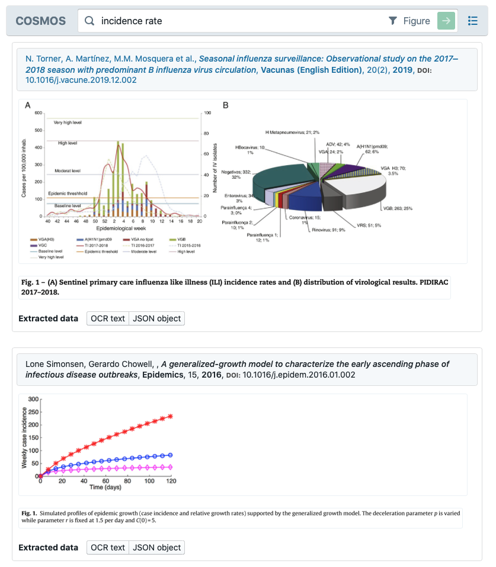
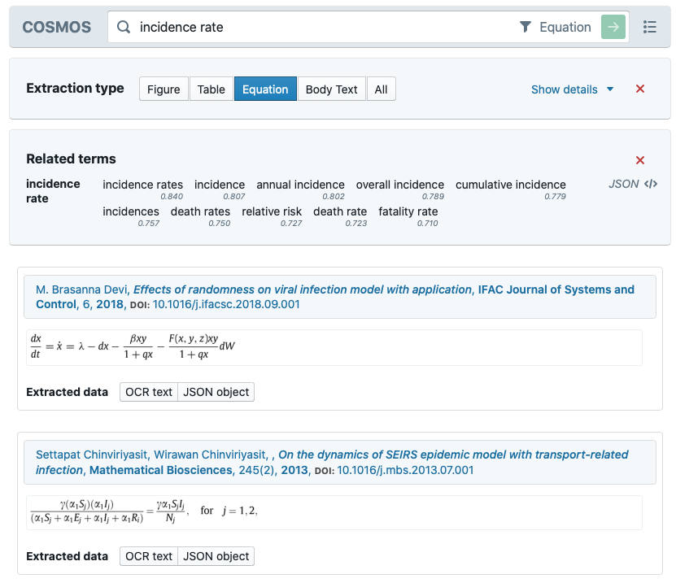
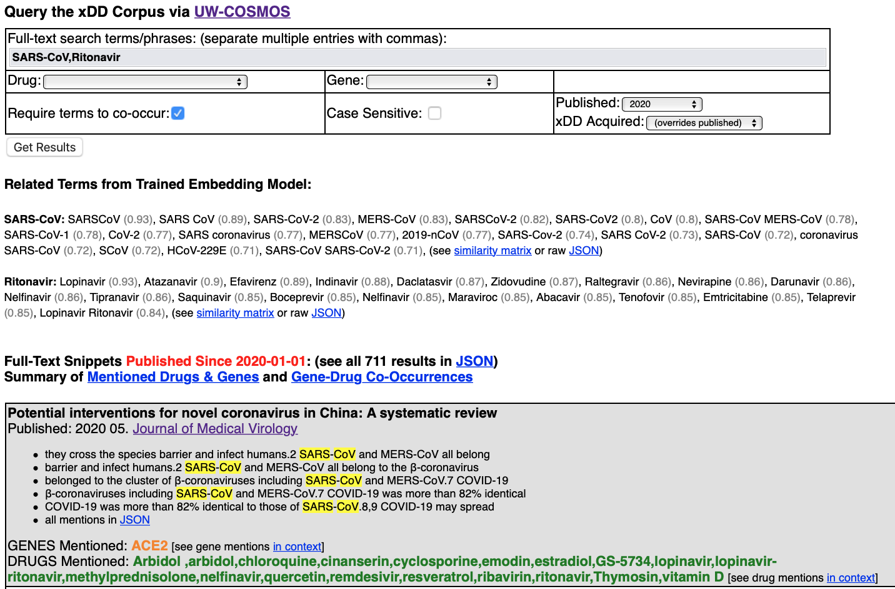
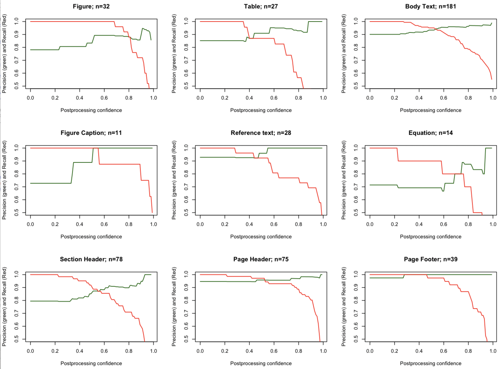

# ASKE Phase 2 Final Report: UW-Madison COSMOS Project
Organization/Date: UW-Madison, 07/31/2020

PIs: Prof. Shanan Peters, Prof. Theodoros Rekatsinas, and Prof. Miron Livny

## 1 Overview of The COSMOS Project
The primary goal of the UW-Madison COSMOS project is to automate key steps in the curation of scientific information, data, and models from the published literature in an ongoing, repeatable fashion as the literature is produced. Our approach is to develop and deploy software, including AI components, that provide a variety of scalable microservices operating over the continuous stream of scientific publications and preprints that are aggregated by the UW-xDD document acqusition and processing infrastructure. In this final report for Phase 2, we provide **a summary that outlines key accomplishments, with special emphasis on deliverables and outcomes emerging from our pivot into a program-wide SARS-CoV-2 response**. We also provide an overview of the software and data products developed during Phase 2, with associated links to code repositories and documentation. Most of these resources, along with links to presentations and milestone reports, are also linked to and described on our UW-[COSMOS project-docs repo](https://github.com/UW-COSMOS/project-docs).

The use-case anticipated at the start of Phase 2 involved curating data and information relevant to the [cGENIE Earth Systems Model](https://github.com/UW-COSMOS/cgenie.muffin), a Fortran-based model of intermediate complexity capturing biogeochemically relevant components of the ocean-atmosphere system (e.g., carbon cycling). The emergence of the COVID-19 pandemic in early 2020 prompted a complete pivot of our Phase 2 activities into this domain. Our success in this pivot stands out as a clear demonstration of the generalizability of all of our project components. There were two generalizable primary tasks in Phase 2:

###  Task 1: Extraction of Model-Relevant Data and Information from Publications
#### Subtask 1. Development and deployment of barebone KBC system for scientific model curation, including equations.
Open-source release of KBC system and deployment on xDD for continuous ingestion of relevant input documents.

### Task 2: Extraction of Tables and Figures from Publications
#### Subtask 1. Refinement of code and deployment of table/figure/equation extraction pipeline over xDD.
Open-source release of table/figure methods and deployment in xDD for continuous ingestion of relevant input documents.

#### Subtask 2. Construct unified KB capturing the heterogeneous, multimodal information in scientific publications.
Release of barebone-KB (with indexed and retrievable figures, tables, and equations) from ingested documents.

Here we first provide **an executive summary where we outline the main research-, code-, and data-products** that the COSMOS team developed during Phase 2. We then provide **a high-level description of the COSMOS pipeline with links to the code modules and their documentation**. Finally, we discuss **lessons-learned and research challenges highlighted by our efforts**.

## List of Research, Code, and Data Products
1. A submission to ICCV 2019 [http://iccv2019.thecvf.com](http://iccv2019.thecvf.com) on a new deep learning model for object detection.
2. An open-source release of the COSMOS pipeline, which can be found at [https://github.com/UW-COSMOS/Cosmos](https://github.com/UW-COSMOS/Cosmos).
3. An open-source release of the [COSMOS document annotator](https://github.com/UW-COSMOS/cosmos-visualizer) and annotation visualizer, a web-based software package designed to allow the rapid creation of richly annotated documents.
4. An open-source [Dockerized end-to-end version](https://github.com/UW-COSMOS/Cosmos) of the complete, document-to-interface COSMOS pipeline, with instructions for how to instantiate on a local development machine.
5. A [live search interface](https://cosmos.wisc.edu/sets/covid/) over the KB constructed by the COSMOS pipeline deployed over the set of xDD documents that are relevant to COVID-19 (as identified by xDD text indexing and document management services). A brief overview of the COSMOS search interface is provided in [this video](https://www.youtube.com/watch?v=w69j2N75NEU).
6. Enhanced, fine-grained text retrieval capabilities and better documentation for the [xDD API](https://geodeepdive.org/api/), deployed over the full-text content of 12.7M scientific papers.
7. A [live search interface](http://teststrata.geology.wisc.edu/xdd/) built on the xDD API and operating over 12.7M documents in the xDD corpus, with output tailored to drug and gene co-occurrences and word embedding model results from the COVID-19 set. A short video describing the components is available [here](https://www.youtube.com/watch?v=FM2sIcZn8ZE).
8. A [Colab Python notebook](https://colab.research.google.com/drive/1Blz6VR_P2vfPNPjUZeUYvV7EPA4UhbUv) demonstrating the use of xDD and COSMOS APIs to do fine grained retrieval and basic question answering.
9. A Docker container mechanism for automatically deploying HMS [INDRA](http://www.indra.bio) code over targeted xDD document sets and delivering INDRA statements to remote location for ingestion into local workflows; this will serve as a template for a general service for other AKSE teams.

## 2 COSMOS Project Executive Summary
We have completed initial releases of three primary deliverables for Phase 2, which encompasses all subtasks within Tasks 1 and 2 as well as some additional capabilities that were developed in response to the specific use cases and requirements presented by ASKE's COVID-19 work.

#### Deliverable 1: Table, Figure, and Equation Extraction and KBC Engine.
Our technical solution to the problem of recognizing and extracting table, figure, and equation elements from heterogeneously formatted scientific publications, a key element of Tasks 1 and 2, are described in a paper published on the [ArXiv](https://arxiv.org/abs/1910.12462). The new visual document segmentation model describe therein, Attentive-RCNN, yields at least a 17% improvement compared to state-of-the-art object detection models and can be successfully applied across a wide-range of PDF documents published between 1970 and today. See additional performance statics below.

The quality of the Attentive-RCNN model’s document regional proposals and classifications will continue to improve as we accumulate additional training data using the [web-based visual annotator](https://www.youtube.com/watch?v=ZTWrRk5i2-8) we developed and as we refine the model and post-processing steps (an area of active research interest).

The code for the entire COSMOS model pipeline is contained in our primary project repo: https://github.com/UW-COSMOS/Cosmos. This repo also contains a README describing the overall system and basic code-level documentation (https://uw-cosmos.github.io/Cosmos/). The input for the COSMOS pipeline is a directory of PDFs and the primary outputs are simple KBs (i.e., databases). Our software stack for COSMOS also includes basic visualization and search interfaces operating over this KB, providing keyword-based retrieval of figure, table, and equation elements. For convenience, we also provide docker images with the entire COSMOS end-to-end pipeline. Step-by-step instructions for deploying the docker images with the entire end-to-end pipeline are found in the cosmos-demo repo, with a [testing set from the COVID-19 literature](https://github.com/UW-COSMOS/Cosmos/tree/master/examples/covid).

#### Deliverable 2: Searchable KB for Table, Figure and Equations Extracted from the SARS-CoV-2 xDD Document Set.
We have deployed the COSMOS model pipeline on two COSMOS GPU computing infrastructure nodes over a subset of publications from xDD that are pertinent to SARS-CoV-2. At the time of this report, this full-text document set contains over 63,000 publications, including preprints from bioRxiv and medRXiv. An interface to explore the COSMOS knowledge base is provided in our [shipped interface](https://cosmos.wisc.edu/sets/covid/). Note that we will continuously improve the quality of extractions available via this portal as we expect to incorporate updates to our Attentive-RCNN and post-processing algorithms to improve quality. Note too that our model is completely domain-agnostic. Our focal project for Phase 2, and the target of almost all of our training data, was oriented around Earth Systems model, but the xDD infrastructure and Attentive-RCNN model encompass all domains of published scholarly knowledge and our public COVID-19 vertical is in the biomedical literature.

<b>Figure 1. Search for Figures containing target search terms in the COSMOS [search interface](https://cosmos.wisc.edu/sets/covid/?backend=Anserini&query=incidence%20rate&type=Figure)</b> deployed over xDD COVID-19 document full-texts.

<b>Figure 2. Search for Equations containing target search terms in the COSMOS [search interface](https://cosmos.wisc.edu/sets/covid/?backend=Anserini&query=incidence%20rate&type=Figure)</b>, deployed over xDD COVID-19 document full-texts.

## 3 COSMOS Pipeline Description
### Document Acquisition and Computing Infrastructure
Since the start of Phase 1, xDD infrastructure, an integral part of the UW-COSMOS pipeline, has accumulated millions of additional documents from multiple commercial and open-access publishers. Over 12.7M documents spanning all domains of scholarship are now accessible to UW-COSMOS and ASKE collaborators. Negotiations with additional publishers (notably, Springer-Nature) are underway and we anticipate that the xDD document acquisition pipeline will continue to grow the library at a rate of approximately 5K documents/day throughout the duration of Phase 3. Currently, xDD is one of the world’s largest single repositories of scientific publications that span all domains of knowledge, incorporates new documents automatically and updates API endpoints every hour, and that spans all domains of scientific knowledge. The uniqueness of the xDD document acquisition and management system is a central component of the UW-COSMOS project.

<b>Figure 3. Search interface over all 12.7M documents in xDD</b>, with results tailored to COVID-19 queries [example search](http://teststrata.geology.wisc.edu/xdd/index.php?word=SARS-CoV,Ritonavir). This interface provides a visual mechanism to generate REST-ful API calls to xDD. Links within the results are to formatted URLs, which can be incorporated into any third party application seeking to provide arbitrary full-text search and retrieval. Also shown are co-occurring genes and drugs within each document.

In addition to the xDD digital library and document acquisition system and coupled high throughput computing resources provided by the UW-Madison CHTC, core UW-COSMOS project computing infrastructure consists of four high-performance GPU systems (four machines were acquired and stood-up at the start of the project). These high-performance GPU nodes (80 core, 2.4Ghz Intel Xeon(R) Gold 6148 CPUs, 512GB RAM, Nvidia Tesla V100 32GB) are essential to supplying the throughput necessary to process large numbers of documents and populate KBs in the COSMOS pipeline. This type of compute is required as we are dealing with mixed workloads. Attentive-RCNN benefits from GPUs as it relies on expensive to run Convolutional Neural Networks. The speed ups we observed due to the use of GPUs are at least 10x. Knowledge base construction and OCR on the other hand benefit from parallelism across CPUs.

### System Architecture
COSMOS consists of 9 main modules, all outlined in https://github.com/UW-COSMOS/Cosmos, and a visualization and search end-point for results (https://github.com/UW-COSMOS/cosmos-visualizer). A high-level description of how these modules interact is provided in the repo documentation, in our [interim report](https://github.com/UW-COSMOS/project-docs/tree/master/presentations_reports/milestone_3).

The input to the COSMOS system is a collection of PDF documents and the output is a collection of xml files and database tables that represent the extracted knowledge bases. A description of the final of our pipeline is provided in the demo README file in the main [COSMOS code repository](https://github.com/UW-COSMOS/Cosmos). The order of the different modules in this last link reflects the order in which they are pipelined. The core elements of our extraction pipeline are also described in detail in the submitted ICCV manuscript (see PDF attached to Milestone Submission).

### Pipeline Performance
Our pipeline has thus far experienced incomplete optimized for end-to-end runtime. In profiling our system for [earlier project reports](https://github.com/UW-COSMOS/project-docs/tree/master/presentations_reports/milestone_3), we identified several performance bottlenecks (such as invoking Tesseract for OCR) that we have preliminarily addressed in our final code release, thereby improving document throughput to approximately 2 seconds per page on GPU-accelerated nodes. Tbe Attentive-RCNN model currently only performs well on GPUs, one of the key motivations for our acquisition of two additional high-performance GPU systems to add to UW-COSMOS infrastructure as we scale for Phase 3.

<b>Figure 4. Precision (green) and recall (red) of COSMOS's "Attentive-RCNN" visual document segmentation and classification system</b>, as measured from 503 manual annotations made in June 2019 for a random selection of pages from the COVID-19 xDD set. Results are plotted as a function of post-processing confidence, the COSMOS-generated estimate for confidence in the region proposal and its classification. By this measure, recall for each class of object will reach 100% when post-processing confidence is lowered sufficiently to include all correct instances. Precision drops as additional incorrect proposals are included in each class. The effective overall precision of the COSMOS pipeline is defined by the y-intercept. In all classes, precision never falls below 0.7. COSMOS quality is high, but can be further improved by generating additional training data, particularly over new journal titles with different layout and formatting conventions. 

### Comparison to Other Methods
The [CORD-19 dataset](https://allenai.org/data/cord-19) quickly emerged at the start of the pandemic as a de facto standard that was by a large number of distributed teams working on machine reading and AI mechanisms. This data was constructed by using PubMed's open access corpus, which was searched for the term "COVID-19 and coronavirus research"). Additional research articles from the WHO and bioRxiv and medRxiv were included using the same search terms to define the corpus. Most of the documents are abstract-only, but full texts are also available. Some PDFs are associated with these full texts, but others consist only of JSON objects with text-only representations. The CORD-19 dataset continues to be updated from these sources, with distributed groups downloading tar archives of the entire dataset.

xDD allowed for the rapid construction of a larger and more diverse corpus that was defined after analyzing full-text content. Many relevant publications are part of this dataset that are not included in CORD-19, either because they are not recognized in the stringent simple string matching to abstracts and keywords provided by publishers and aggregators (PubMed) or because they are not distributed under open access. The ability of xDD to define and construct corpora tailored to specific application requirements and research tasks is a unique capability.

We are currently aware of no other software stack that uses AI-methods to visually parse and segment documents in order to generate a unified intermediate representation of text, figure, tables, and equations. Various software tools exist that take PDF input and, depending on the specific format of the PDF, generate text and visual data products (e.g., extraction of images), but these tools are not suitable for deployment over large and diverse corpora and do not yield intermediate representations suitable for fine-grained information retrieval and knowledge base construction. 
